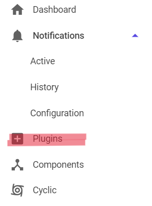

# User Guide

## Table of Contents

1. [Introduction](#introduction)
2. [Registration](#registration)
3. [Main View and Features](#main-features)
   - [Dashboard](#dashboard)
   - [Notifications](#notifications)
   - [Plugins](#plugins)
   - [Components](#components)
   - [Cyclic](#cyclic)
   - [Manage your account](#manage-your-account)
4. [Customization](#customization)

---

## Introduction

Welcome to Lionk! This guide will help you navigate the application's key features. We'll cover the Dashboard for an overview of your system, Notifications to keep you updated, and Manage your account to personalize your settings. You'll also learn about the Plugins, Components, and Cyclic views, which offer additional tools and functionalities to enhance your experience with Lionk. By the end, you'll be well-equipped to use each view effectively.

---

## Registration

Before you can start using the Lionk application, you need to register an account. 

If you are the first user to register, you will automatically be assigned the Admin role, giving you full access to manage the application. If you are not the first user, you will be registered as a standard user with regular access rights.

Make sure to complete this step first to ensure you can fully explore and utilize everything Lionk has to offer.

---

## Main Features

### Dashboard

---

### Notifications

 

**Active:**

The Active section displays notifications that are currently unresolved or require your attention. Each notification is listed with the following details:

- Date: The timestamp when the notification was triggered.
- Severity: The level of importance, such as Information, Warning, or Critical.
- Title: A brief title summarizing the notification.
- Message: A more detailed description of the notification.
- Status: Indicates whether the notification has been read or remains unread.
- Actions: You can take immediate action on the notification by clicking the MARK AS READ button, which will change its status and move it out of the active notifications list.

You can also access active notifications by clicking the button in the app bar wich also indicates the number of unread notifications:

 

**History:**

The History section displays all notifications that have been received, regardless of their current status. This includes both read and unread notifications, providing a complete log of all alerts for your reference.

Together, these sections provide a comprehensive view of both ongoing and past notifications, allowing for efficient monitoring and management of alerts within your application.

 

**Configuration:**

In this view, you can manage the various Notifiers and Channels within your application. This interface allows you to configure how notifications are handled and which channels are used to deliver them.

**Notifiers:**

The Notifiers section lists the different notification triggers that you have set up. Each notifier is represented by its name, and you have the following options:

- Edit: Clicking the pencil icon allows you to modify the settings of an existing notifier such as disabling a channel.
- Delete: The trash bin icon allows you to remove a notifier completely.

You can search for specific notifiers using the search bar located at the top right of this section.

**Channels:**

The Channels section lists the platforms through which notifications are sent, such as Discord, Telegram, and Pushbullet. For each channel, you have the following options:

- Edit Settings: The gear icon allows you to configure the specific settings for each channel.
- Delete: The trash bin icon allows you to remove a channel from the list.

Add: You can add a new channel by clicking the + ADD button.

---

### Plugins

---

### Components

---

### Cyclic

---

### Manage your account

 

**Overview:**

In the section, you can view the basic information about your username and email. Both the Email and Password are editable and can be modified in their respective sections.

 

**Role:**

In this section, you can manage the roles of different users in your application. The table displays the usernames, their associated email addresses, and the roles assigned to each user. You can also delete a user by clicking the red DELETE button in the "Actions" column. This interface allows for quick and easy role management to ensure that users have the appropriate level of access within the application.

---

## Customization

**Dark Mode**: Customize the application's appearance by toggling Dark Mode. This option allows you to switch between the default light theme and a dark theme, which may be easier on the eyes, especially in low-light environments.