# User Guide

## Table of Contents

<!-- @import "[TOC]" {cmd="toc" depthFrom=1 depthTo=4 orderedList=false} -->

<!-- code_chunk_output -->

- [User Guide](#user-guide)
  - [Table of Contents](#table-of-contents)
  - [1. Introduction](#1-introduction)
  - [2. Registration](#2-registration)
  - [3. Main Features](#3-main-features)
    - [3.1. Dashboard](#31-dashboard)
      - [3.1.1. Widget selection](#311-widget-selection)
      - [3.1.2. Widget base configuration](#312-widget-base-configuration)
      - [3.1.3. Widget cyclic configuration](#313-widget-cyclic-configuration)
      - [3.1.4. Manage widgets](#314-manage-widgets)
    - [3.2. Notifications](#32-notifications)
      - [3.2.1 Active tab](#321-active-tab)
      - [3.2.2 History tab](#322-history-tab)
      - [3.2.3 Configuration tab](#323-configuration-tab)
    - [3.3 Plugins](#33-plugins)
      - [3.3.1 Plugins importation](#331-plugins-importation)
      - [3.3.2 Plugins dependencies](#332-plugins-dependencies)
    - [3.4 Components](#34-components)
    - [Cyclic](#cyclic)
    - [Manage your account](#manage-your-account)
  - [Customization](#customization)

<!-- /code_chunk_output -->

---

## 1. Introduction

Welcome to Lionk! This guide will help you navigate the application's key features. We'll cover the Dashboard for an overview of your system, Notifications to keep you updated, and Manage your account to personalize your settings. You'll also learn about the Plugins, Components, and Cyclic views, which offer additional tools and functionalities to enhance your experience with Lionk. By the end, you'll be well-equipped to use each view effectively.

---

## 2. Registration

Before you can start using the Lionk application, you need to register an account. 

If you are the first user to register, you will automatically be assigned the Admin role, giving you full access to manage the application. If you are not the first user, you will be registered as a standard user with regular access rights.

Make sure to complete this step first to ensure you can fully explore and utilize everything Lionk has to offer.

---

## 3. Main Features

### 3.1. Dashboard

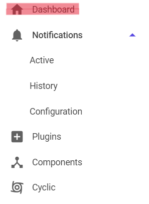

The Dashboard section allows you to manage and configure widgets that display various components and their data within your application. Here’s how you can set up and customize your widgets

#### 3.1.1. Widget selection

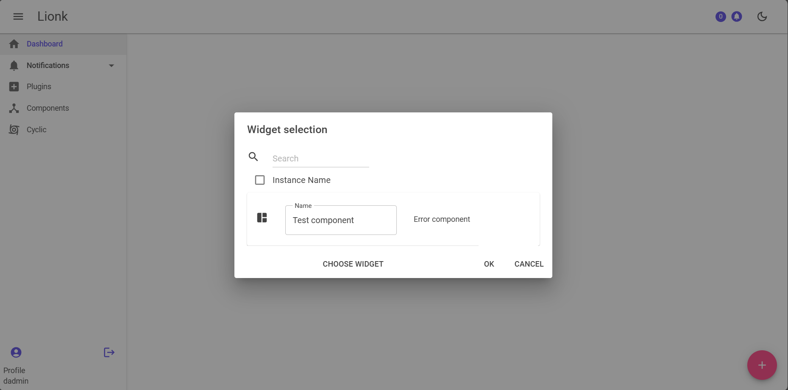

By clicking on the **`+`** flaoting button, you can choose from a list of available components to add to your dashboard. Each component is listed with its name. Select the desired component and click on `CHOOSE WIDGET` to proceed.

##### View selection:

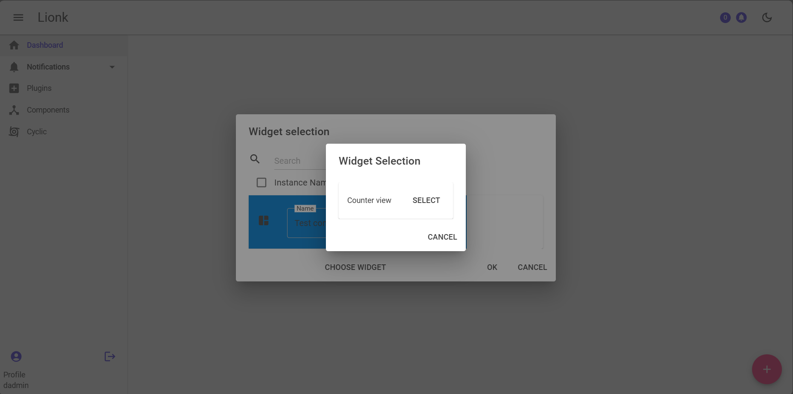

After selecting a component, you will be prompted to select the disponible view. Choose the view by clicking `SELECT`.
Then, click on `OK` to proceed.

Now you can see the selected component with the selected view in the dashboard.

#### 3.1.2. Widget base configuration

By clicking on the configuration button, you can configure the widget's base settings.

//TODO: add image with the configuration button identified

then you will be prompted to configure the widget.

##### Widget base configuration:

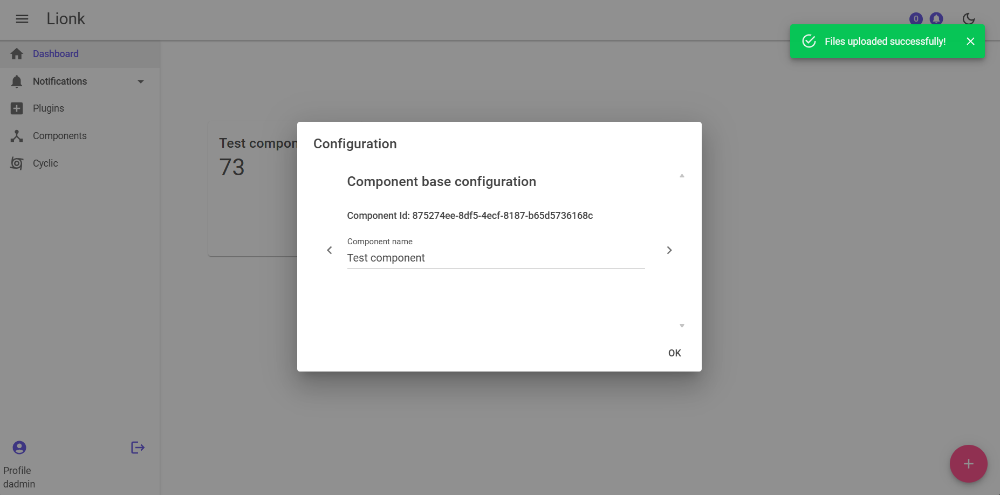

This configuration is accessible by each widget and allows you to set the name of the component directly in the widget.

This modification will affect the component name in the `component` tab.

#### 3.1.3. Widget cyclic configuration

If the component that you want configure is cyclic, a cyclic configuration will be available. by clicking on the left or right arrow.

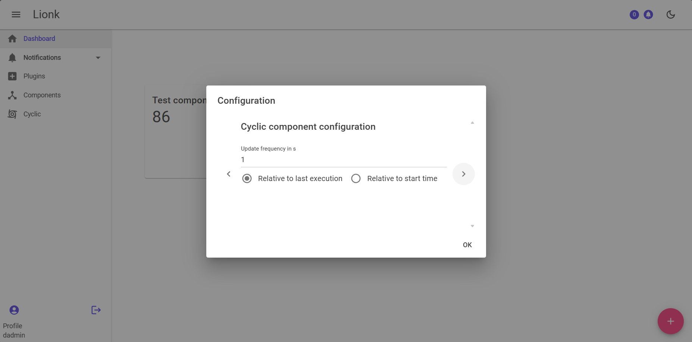

At this point, you can configure the cyclic settings of the component as you wish.
You can update the period of the component and the "next execution" computation. 

When you pass your mouse over the selection of the "Next execution computation" selection radio buttons, you will see a tooltip that explains the different options.

#### 3.1.4. Manage widgets

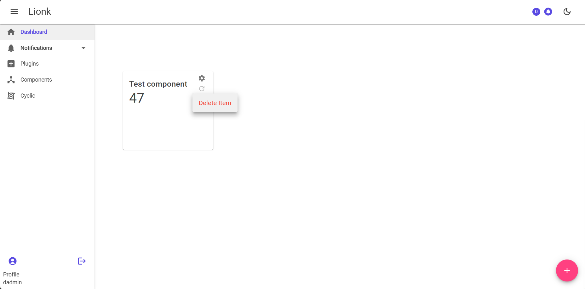

Once the widget is configured and added to the dashboard, you can see it in action on the main dashboard view. The widget will display real-time data based on the component’s performance, and you can interact with it directly, including options to **`configure`**, **`refresh`**, or **`delete`** the widget.

---

### 3.2. Notifications

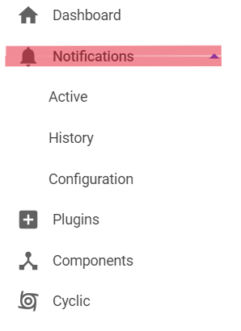

 

#### 3.2.1 Active tab

The Active section displays notifications that are currently unresolved or require your attention. Each notification is listed with the following details:

- Date: The timestamp when the notification was triggered.
- Severity: The level of importance, such as Information, Warning, or Critical.
- Title: A brief title summarizing the notification.
- Message: A more detailed description of the notification.
- Status: Indicates whether the notification has been read or remains unread.
- Actions: You can take immediate action on the notification by clicking the **`MARK AS READ`** button, which will change its status and move it out of the active notifications list.

You can also access active notifications by clicking the **`bell button`** in the app bar which also indicates the number of unread notifications:

 

#### 3.2.2 History tab

The History section displays all notifications that have been received, regardless of their current status. This includes both read and unread notifications, providing a complete log of all alerts for your reference.

Together, these sections provide a comprehensive view of both ongoing and past notifications, allowing for efficient monitoring and management of alerts within your application.

 

#### 3.2.3 Configuration tab

In this view, you can manage the various Notifiers and Channels within your application. This interface allows you to configure how notifications are handled and which channels are used to deliver them.

##### Notifiers:

The Notifiers section lists the different notification triggers that you have set up. Each notifier is represented by its name, and you have the following options:

- **`Edit`**: Clicking the **`pencil icon`** allows you to modify the settings of an existing notifier such as disabling a channel.
- **`Delete`**: The **`trash bin icon`** allows you to remove a notifier completely.

You can search for specific notifiers using the **`search bar`** located at the top right of this section.

##### Channels:

The Channels section lists the platforms through which notifications are sent, such as Discord, Telegram, and Pushbullet. For each channel, you have the following options:

- **`Edit Settings`**: The **`gear icon`** allows you to configure the specific settings for each channel.
- **`Delete`**: The **`trash bin icon`** allows you to remove a channel from the list.

**`Add`**: You can add a new channel by clicking the **`+ ADD`** button.

---

### 3.3 Plugins

#### 3.3.1 Plugins importation

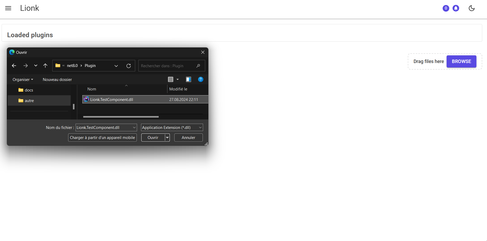

The Plugin Importation section allows you to add external plugins to enhance the functionality of your application. Follow these steps to successfully import a plugin:

**`File Selection`**: Begin by clicking the **`BROWSE`** button to open the file explorer. Navigate to the directory where your plugin .dll file is located, select it (e.g., Lionk.TestComponent.dll), and click **`Open`**.

#### 3.3.2 Plugins dependencies

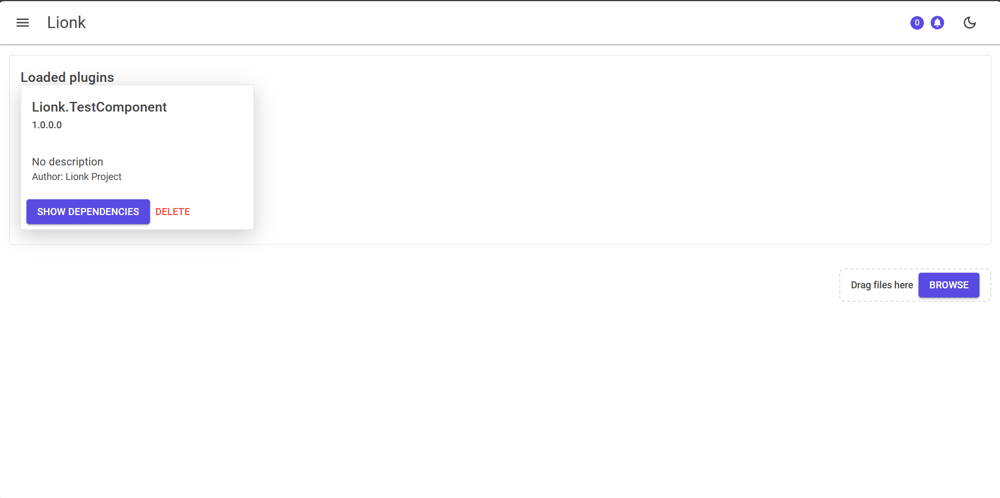

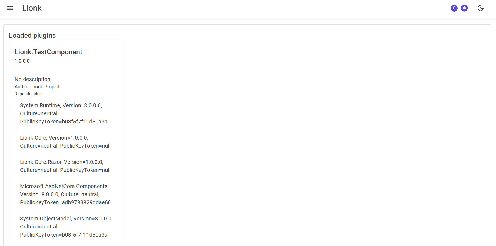

Once the plugin is loaded, it will appear in the list of loaded plugins, displaying key details such as the name, version, and author of the plugin.

After the plugin is loaded, you can click on the **`SHOW DEPENDENCIES`** button to see a list of all the dependencies associated with the plugin. This section provides a detailed view of the required libraries and their specific versions, ensuring that all necessary components are present. 

If some dependecies are missing, an error will be displayed.

---

### 3.4 Components

**View:**

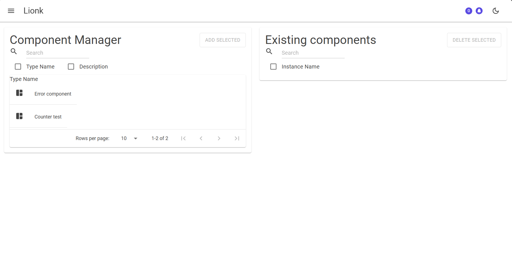

The View section allows you to manage and organize components within your application. This interface provides an overview of available and existing components, enabling you to add or remove them as needed.

**Available components:**

In the Available components section, you can see a list of all the components that can be added to your application. Each component is listed with its type and description. To add a component to your application, select it and click the **`ADD SELECTED`** button.

**Existing components:**

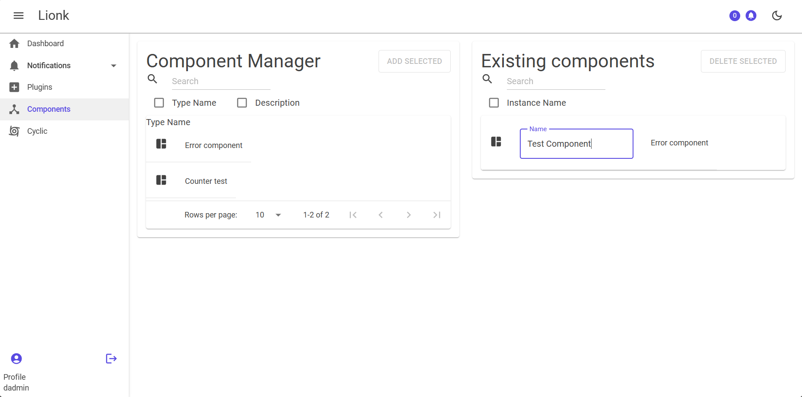

The Existing components section displays the components that have already been added to your application. You can search, rename, and delete components from this list. To remove a component, select it and click the **`DELETE SELECTED`** button.

**Finalization:**

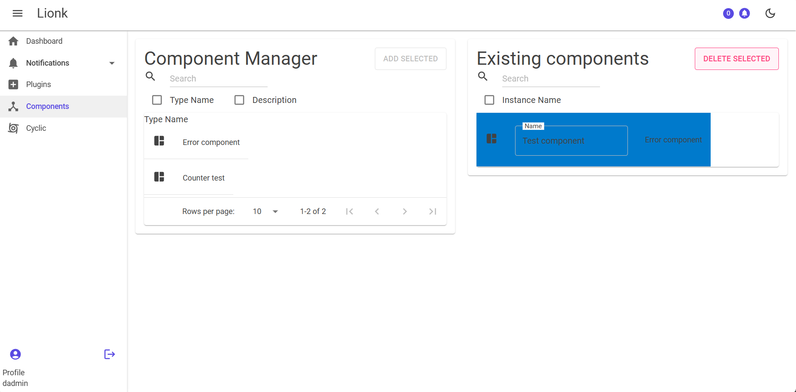

The Finalization step confirms your component configurations. Once you have reviewed the existing components and made the necessary adjustments, finalize your setup by clicking the appropriate button. This ensures that your components are correctly configured and ready for use within the application.

---

### Cyclic

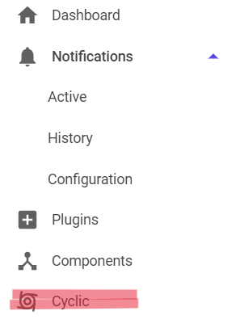

**View:**

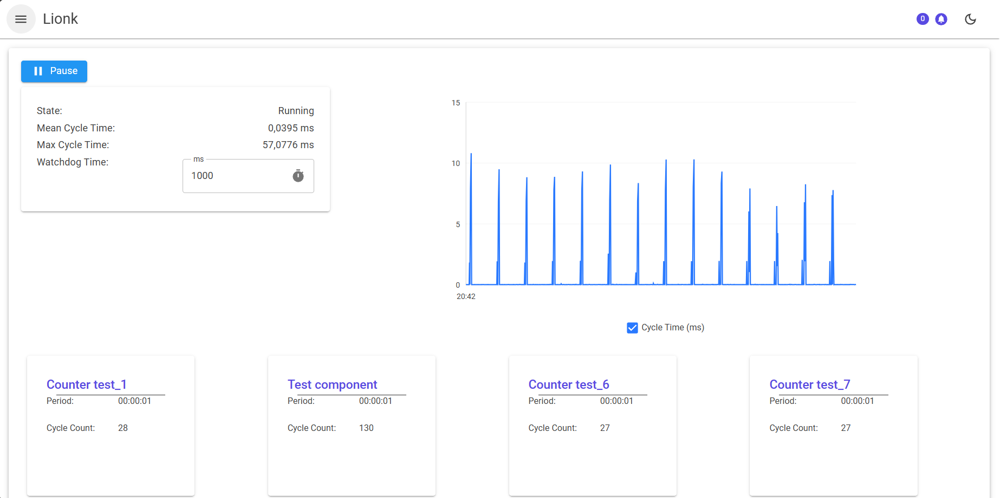

The View displays the current state of the cyclic processes, including key metrics such as:

- State: Indicates whether the process is currently running or paused.
- Mean Cycle Time: The average time taken for one complete cycle, measured in milliseconds.
- Max Cycle Time: The maximum duration recorded for a single cycle.
- Watchdog Time: A configurable time threshold that monitors the maximum allowable cycle time before triggering a warning.

You can pause the cyclic processes using the **`Pause`** button, and adjust the Watchdog Time as necessary to ensure optimal performance.

 

**Components:**

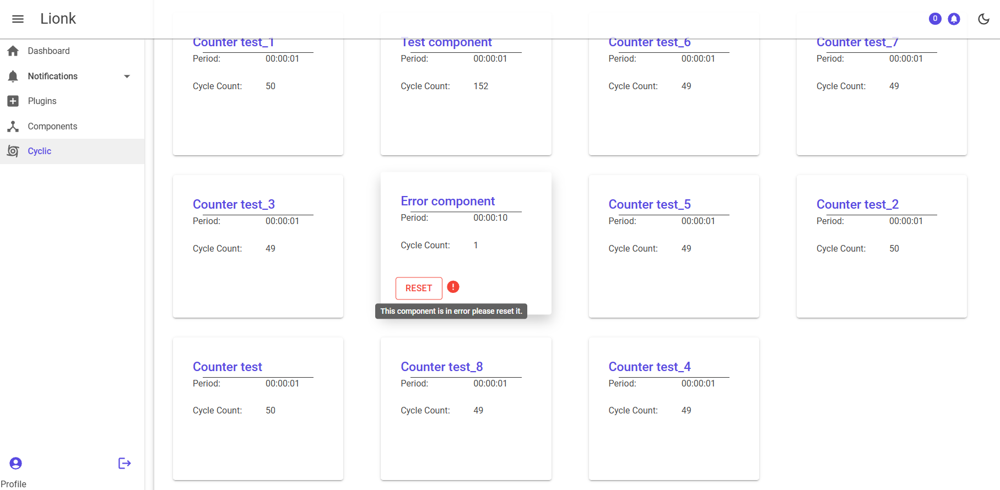

The Components section lists all the active components that participate in the cyclic process. Each component is displayed with the following details:

- Period: The time interval at which the component operates.
- Cycle Count: The number of cycles the component has completed.

Components in error state will prompt an **`action button`** (e.g., **`RESET`**) allowing you to address issues directly from this view, ensuring that all components function correctly within the cyclic system.

---

### Manage your account

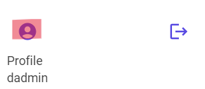

 

**Overview:**

In the section, you can view the basic information about your username and email. Both the **`Email`** and **`Password`** are editable and can be modified in their respective sections.

 

**Role:**

In this section, you can manage the roles of different users in your application. The table displays the usernames, their associated email addresses, and the roles assigned to each user. You can also delete a user by clicking the red **`DELETE`** button in the "Actions" column. This interface allows for quick and easy role management to ensure that users have the appropriate level of access within the application.

---

## Customization

**`Dark Mode`**: Customize the application's

 appearance by toggling **`Dark Mode`**. This option allows you to switch between the default light theme and a dark theme, which may be easier on the eyes, especially in low-light environments.